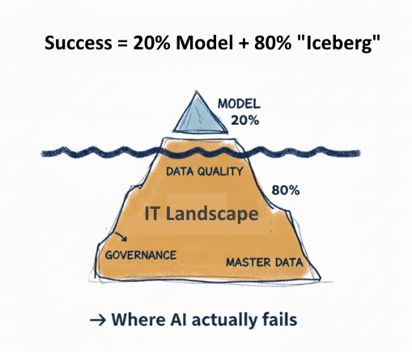

# AI Context

## We navigate around legacy iceberg

> - We help "CMM invigorated" organizations understand and acknowledge the iceberg they have to deal with
> - Just then we build the model of future together

After the products are well described, organization can proceed to

## AI-assisted Software Development

> - AI is conceptual and marketing term
> - LLM is tool engineered after AI concepts

We are working together with our clients using LLM tools, as long as we are aligned on the 2025 DORA Report. Succinctly: LLM of your choice is your own assistant. But you are accountable for your output.

> [Please make sure you have downloaded and read the 2025 DORA Report](https://dora.dev/research/2025/dora-report/)
>
> Use [PDF from this site](#download-our-copy-pdf-of-the-dora-ai-capabilities-model) or download the [online document](#or-use-your-own-download).

The DORA AI report will resonate true for several years. Until further notice. And if it ever comes that notice will be far in the future.

#### You are accountable for your contributions to the project. LLM or no LLM, which LLM etc. All contributions are your responsibility.

---

## DORA AI Capabilities Model

DORA is primarily audience is Software Development Organizations. We have repurposed its core to be used as part of our AI usage guidance.

---

<strong>Why We Follow the DORA AI Capabilities Model</strong>

- **Clear AI Strategy and Policies**
  Together, we establish clear guidelines so your team knows exactly when and how to use AI safely—no guesswork, no fear of making mistakes.
  Not just software development but teams in other business-like roles.

- **High-Quality Internal Platforms**
  We advise on how to build and maintain development infrastructure that just works. Your developers shouldn't fight their tools—they should focus on delivering value.
  That applies to other projects and teams producing architectural artifacts in the Product development phases.

- **Clean, Accessible Data**
  AI is only as good as the data it learns from. We ensure information is well-organized and accessible so AI can actually help, not hallucinate.
  That is about transforming the invisible part of the iceberg.

- **Strong Developer Experience Focus**
  Happy developers build better software. We prioritize workflows that your team will actually enjoy using—because that's how real adoption happens.

- **Learning-Oriented Culture**
  We encourage experimentation over perfection. Your team should feel safe to try new AI approaches without fear of blame when things don't work the first time.
  That is a direct attribute of your CMM compliance and success.

- **Modular, Decoupled Architecture**
  We design systems that can evolve. Legacy constraints shouldn't hold you back from adopting new AI capabilities as they emerge.
  Your CMM based organization also requires Architecture Professional.

- **User-Centric Thinking**
  Technology for its own sake is worthless. Every AI implementation we recommend must solve a real problem for your end users—that's the only metric that matters.
  This is why we advise Business Analyst presence in Product declarations.

---

The **DORA AI Capabilities Model** report is a companion guide to the 2025 State of AI-assisted Software Development report. It serves as a practical guide to the seven capabilities that amplify the benefits of AI. For each of the seven core capabilities, this report details implementation strategies, specific tactics for teams to get started, and methods for monitoring progress and fostering continuous improvement.

#### Download our copy [PDF of the DORA AI Capabilities Model](assets/2025_dora_ai_capabilities_model.pdf) (size: 9MB)

#### Or use [your own download](https://cloud.google.com/resources/content/2025-dora-ai-capabilities-model-report)

## What is DORA?

DORA (DevOps Research and Assessment) is a research program that identified four key metrics for measuring software delivery performance:

1. **Deployment Frequency** - How often code is deployed to production
2. **Lead Time for Changes** - Time from commit to production
3. **Change Failure Rate** - Percentage of deployments causing production failures
4. **Time to Restore Service** - How quickly service is restored after incidents

Software development teams are classified as Elite, High, Medium, or Low performers based on these metrics. DORA metrics help quantify DevOps maturity and guide improvement efforts.

**Google Cloud** is the primary company behind DORA.
