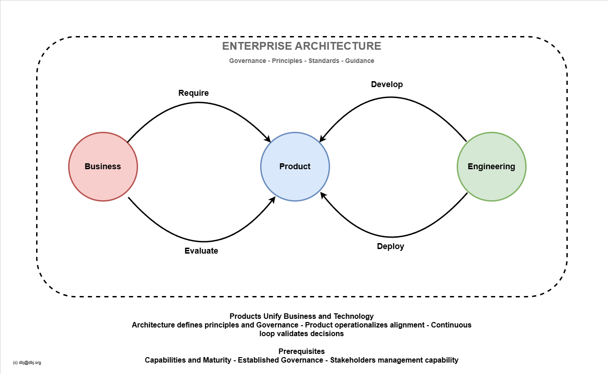

# Business Process Technology (BPT) Meta Loop

This diagram represents **Enterprise Architecture role as the governing meta-layer** that orchestrates the Business-Product-Technology relationship through continuous cycles (loops).

> **Key strengths:**
> - Product is the natural alignment point between Business and Technology
> - Architecture operates "above" the process, not within it
> - [CMM](cmm.md) prerequisite filters out organizations lacking foundational maturity
> - Continuous loop maps to operational rhythm, not rigid phase gates

**Architecture's role:**
- Defines principles that guide all four transitions (Require/Develop/Deploy/Evaluate)
- Ensures Product decisions maintain Business-Technology coherence
- Governs without bottlenecking the cycle
- Measures alignment health through evaluation feedback

**This works because:**
- Organizations at sufficient CMM level have implicit governance structures
- Product management becomes the **operational manifestation** of architecture
- The loop tests architecture decisions against reality continuously
- Answer to a difficult question: "Is Business aligned with Technology?", becomes measurable

**In TOGAF terms:** This is Architecture Governance as a productized execution model, not replacing TOGAF ADM but providing the operational CMM based framework ADM governs.

> **Bottom line:** Product unifies; Loop validates.

---
&copy; dbj@dbj.org
