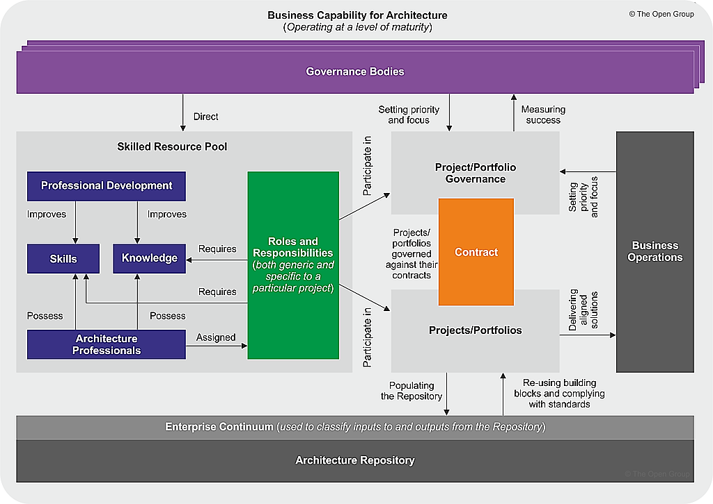

# Capability Maturity Model (CMM)

> **TIP:** Formal foundations are in TOGAF CMM
> https://www.opengroup.org/architecture/0310wash/presents/Judith_Jones-Maturity_Models.pdf

## Overview

In the ever-evolving landscape of Information Technology (IT), organisations seek effective methods to enhance their development processes and gain better control over their architectural endeavours. The Architecture Capability Framework, deeply rooted in the Capability Maturity Models (CMM), emerges as a powerful tool within The Open Group Architecture Framework (TOGAF). This framework provides organisations with a structured approach to gradually improve their Technology-related processes. One prominent aspect of this framework is the Architecture Capabilities Maturity Model (ACMM).

## What is CMM

There is a whole Landscape of Capability Maturity Models (CMMs). TOGAF's Architecture Capability Framework draws inspiration from various Capability Maturity Models (CMM), each tailored to address specific aspects of organisational processes. Some notable models include the Capability Maturity Model Integration (CMMI), Software Acquisition Capability Maturity Model (SA-CMM), Systems Engineering Capability Maturity Model (SE-CMM), People Capability Maturity Model (P-CMM), IDEAL Life Cycle Model for Improvement, and the Enterprise Architecture Capabilities Maturity Model (ACMM).

## Components of the ACMM

The ACMM, a crucial part of the Architecture Capability Framework, comprises three main sections:

1. **Architecture Maturity Model**: This section defines the six levels of maturity for nine key architecture characteristics. The levels range from 0 (None) to 5 (Measured), depicting the evolutionary journey an organisation undertakes in enhancing its architectural capabilities.
2. **Architecture Characteristics of Processes at Different Maturity Levels**: The nine architecture characteristics provide a comprehensive view of an organisation's architecture capabilities. These include architectural process, architectural development, business linkage, senior management involvement, operating unit participation, architectural communication, Technology security, architectural governance, and Technology investment and acquisition strategy.
3. **The ACMM Scorecard**: The ACMM scorecard acts as a monitoring and assessment tool. It allows organisations to gauge their current maturity level in each of the nine characteristics, enabling a clear understanding of strengths, weaknesses, and areas for improvement.

## Levels and Characteristics

**Levels**: The six maturity levels serve as milestones, representing the organisation's progress in building and refining its architecture capabilities.

- M0 — None (no architecture capability)
- M1 — Initial (ad-hoc)
- M2 — Under Development (processes being defined)
- M3 — Defined (documented, standardised)
- M4 — Managed (measured, controlled)
- M5 — Optimising (continuous improvement)

## Characteristics

The nine architecture characteristics offer a granular perspective on various dimensions of an organisation's architecture. From the intricacies of architecture processes to the strategic aspects of IT/Technology investment and acquisition strategy, each characteristic contributes to the overall maturity of the organisation.

### The nine TOGAF ACMM characteristics:

1. **Architecture Process** — how architecture work is performed (ad-hoc vs. repeatable vs. optimised)
2. **Architecture Development** — maturity of producing architecture artefacts and deliverables
3. **Business Linkage** — alignment between architecture and business strategy/goals
4. **Senior Management Involvement** — executive sponsorship and engagement with EA
5. **Operating Unit Participation** — involvement of business units in architecture processes
6. **Architecture Communication** — how architecture is communicated across the organisation
7. **IT Security** — integration of security into architecture practice
8. **Architecture Governance** — controls, compliance, decision-making structures
9. **IT Investment and Acquisition Strategy** — how architecture informs technology investment decisions

Each characteristic is assessed independently across the maturity levels (M0–M5), giving a multi-dimensional view rather than a single score. An organisation might be M3 on Governance but M1 on Business Linkage.

> Practical use: CMM "meter" helps identify specific capability gaps rather than blanket "you're immature" statements.
>
> Useful for targeted improvement roadmaps.

## Conclusion

The Architecture Capability Framework in TOGAF, particularly the Architecture Capabilities Maturity Model, empowers organisations to enhance their Technology-related development processes systematically. By leveraging the structured approach of maturity levels and characteristics, organisations can not only gain control over their architecture but also pave the way for continuous improvement. As the technological landscape continues to evolve, embracing frameworks like ACMM becomes imperative for organisations aspiring to thrive in the realm of Information Technology.
