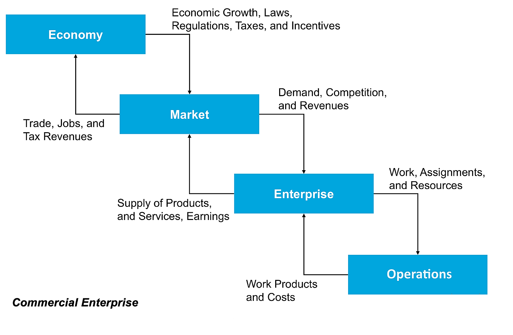

# Commercial Enterprise

- Widest possible scope of Enterprise existence
- Organization location for the information space navigation

## Enterprise Internal Organization

Taxonomy provides the structural foundation that characterizes a capable and mature enterprise.

See [Taxonomy](taxonomy.md) for details.
