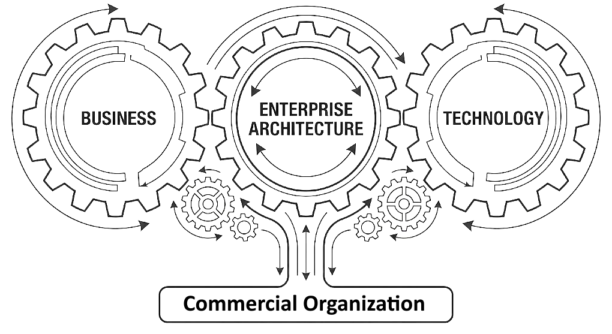

## What is a Commercial Enterpise?

- Business entity aligned to external and internal forces. Best describd with a diagram.
   - [Commercial enterprise](pages/commercial_enterprise.md) in the global geo-political continuum.

## 1. What is Enterprise Architecture?

> &nbsp;
>
> Primary role of the EA
>
> **Enterprise Architecture aligns business and technology**
>
> &nbsp;
> 
>
> [TOGAF](https://www.opengroup.org/togaf) is a global standard for management of Enterprise Architecture. Aim is very simple: to improve the business eficiency.
>
> &nbsp;

## 2. Iron Code Labs Enteprise Architecture (ICL EA)
- **ICL EA is a subset of [TOGAF](https://www.opengroup.org/togaf)**
   - It is taylored, by our EA navigator, for your smooth sailing
   - Guding principle: Aligned with the aim of performing small but measurable steps delivering visible benefits

## 3. Capbility Maturity Model (CMM)

Why Climbing the CMM Ladder

CMM is a formal foundation for managing and measuring organisation capability and maturity. It is based on TOGAF CMM. For details please [proceed here](pages/cmm.md).

ICL EA has developed a simplified CMM adoption Method. It is simplified because it is aligned to the core idea of fast but feasible delivery under the guidance of EA.

Existence of **Taxonomy** and its widepsread usage is a sign of organization higher on the CMM ladder. [Taxonomy](pages/taxonomy/index.md) provides the structural foundation that characterizes a capable and mature enterprise.

## 4. How is Feasible Delivery achieved?

### Decoupling Business and Technology
- Business declares products
- Technology implements products
- EA guides the organization and manages the whole process

### Evolving Products feasibly 

NOTE: Product by its widest possible definition.  Although in the context of ICL EA, primary focus is on software systems, products and services.

- Each step is a measure of AE efficiency

1. Require
2. Develop
3. Deploy
4. Evaluate
5. Repeat

### By following the ICL BPT Methodology. 
Core of the BPT Methodology is [BPT Meta Loop](pages/bpt.md).

#### Key actors in the BPT Metodology
- **Business** declares products
- **Product** bridges business needs and technical capabilities
- **Technology** implements products
- **EA** guides the organization and manages the whole process

[BPT Meta Loop](pages/bpt.md) is the agile method for guiding the overall enterprise process: from Architecture to Product delivery, guided by our simplified TOGAF approach.

## 5. [AI is inside](pages/AI.md)

- Our guding principle is to understand why and how we and our customers use AI. 
- We are not used by AI. 
- If things go wrong we do not blame it on AI. 
- AI is marketing term. LLM is enginering. 
- We do not blame it on the tool.

---
Subject to change, material in this site is &copy; dbj@dbj.org , CC BY SA 4.0