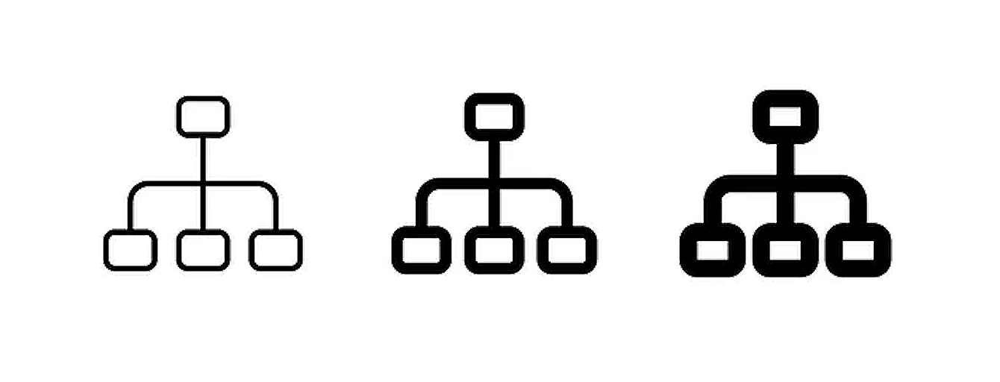

# Architecture Taxonomy

> Taxonomy is GPS of the Information Space. It is essential "tool" for locating information (hence the GPS analogy).



## What is a Taxonomy?

- A taxonomy is a hierarchical organizational framework for structuring information across various systems
- In commercial enterprises it is used to solve business problems like improving data discovery, knowledge management, and content governance.
  - It provides a predefined classification system that categorizes technical assets, documentation, and resources from general to specific topics, enabling IT organizations to efficiently organize, locate, and reuse information.

- Taxonomy is GPS of the Information Space. It is essential business "tool" for locating information (hence the GPS analogy)
- Simple well defined Taxonomy is applicable for various types of business activities, undertaken by various actors in the business information space.
- Taxonomy does exist but it is not visible. It is underlying mesh holding the business information space together

### IT Taxonomies represent structured organizational schemes that can cover various IT domains.

Through four key IT architectural categories:

1. **Concepts** (foundational principles and business requirements)
2. **Logical** architecture (system designs and relationships)
3. **Physical** architecture (infrastructure and deployment models)
4. **Implementation** architecture (internal software technologies and deployment)

This top level, simple progression supports better decision-making and operational efficiency by creating intuitive pathways for information access, while helping organizations maintain consistency in how technical knowledge is classified, shared, and leveraged across different teams and systems.

### Software Taxonomy

Please notice the overarching technology neutral terminology. Taxonomy as a concept is applicable across the various disciplines. Anything that can be defined and stored following the common logic of classification aka "taxonomy". Of course here we are primarily concerned with software in particular and IT in general.

IT Architecture Delivers Software. In a series of planned multidisciplinary activities, executed by a team of Actors organized in four categories naming the roles.

As any other complex system, software is planned and delivered in a sequence of steps from higher to lower levels of abstraction.

Our 4 categories are actually progression through levels of abstractions. From the most abstract to the least abstract level. We are mandating 4 levels:

> `Conceptual → Logical → Physical → Implementation`
>
> "From idea to the product"

As Organization IT Landscape Classification, Taxonomy is essential for cataloguing and ordering. This is essential activity before any kind of feasible IT management can start.

As Architecture classification logic, taxonomy hierarchy is essential for software product development management. As it describes the information content of deliverables each stage should produce.

## The Taxonomy Hierarchy

> **NOTE:** Shared simple Taxonomy is most important communication asset in your organization

- Use this as the simple primary source of truth on taxonomy in your organization
  - Use those terms as common vocabulary
  - It is extremely important to share simple common vocabulary
- **Taxonomy is a hierarchical structure. First level of the hierarchy is called "Categories", second level is called "Capabilities"**
- Capabilities added are turning the four top level categories into full software taxonomy.
- Taxonomy "category" together with its four "capability" siblings is a complete definition for a single category.
- This Taxonomy is applicable to wide spectra of organization activities
  - and roles performing those activities

---

<details open>
<summary><strong>Conceptual</strong></summary>

*Focuses on foundational aspects of software, emphasizes goals, data, functions, and technologies, serves as a high-level blueprint, ensures alignment with business objectives, organizes information effectively, delivers desired functionality, utilizes appropriate technologies, and establishes shared understanding among stakeholders.*

- **Business** — Defines the business goals and objectives that software is intended to support, focusing on aligning software with organizational strategy and desired outcomes.
- **Information** — Focuses on the data that software processes and manages, including its structure and relationships, ensuring data is structured to meet the needs of the organization and its processes.
- **Application** — Describes the specific functions and features of the software, such as user interfaces, data processing, and reporting, defining what the software does and how users interact with it.
- **Technology** — Outlines the underlying technologies used to build and operate the software, such as programming languages, databases, and operating systems, highlighting the technical foundation that supports the software's functionality.

</details>

<details>
<summary><strong>Logical</strong></summary>

*Addresses structural and operational aspects of software, provides a detailed view of software functionality, covers data management strategies, includes system integrations, discusses software platform and security measures, bridges the gap between conceptual design and physical implementation, ensures seamless and secure interaction of components, and maintains a robust framework.*

- **Data Management** — Addresses how data is stored, accessed, and managed within the software, ensuring efficient handling and organization of data for various operations.
- **Integration** — Focuses on how the software interacts with other systems and applications, facilitating seamless communication between different software systems.
- **Platform** — Describes the software environment and infrastructure on which the software runs, providing a stable foundation to host and execute the software.
- **Security** — Defines the measures taken to protect the software and its data from unauthorized access and threats, safeguarding sensitive information and ensuring compliance with standards.

</details>

<details>
<summary><strong>Physical</strong></summary>

*Focuses on tangible and technical resources, encompassing hardware, infrastructure, network communication, and storage systems. It ensures a stable, efficient, and scalable environment, addresses performance needs, and enables reliable data processing and connectivity.*

- **Compute** — Addresses the hardware resources used to run the software, such as servers and processors, providing the computational power necessary to execute the software.
- **Infrastructure** — Describes the physical environment in which the software operates, including data centers and network connections, supporting the software with physical and virtual infrastructure.
- **Network** — Focuses on the communication pathways used to connect the software components and users, ensuring connectivity and data exchange between systems and users.
- **Storage** — Defines how data is stored and retrieved, including the types of storage devices used, managing data storage to support both short-term and long-term requirements.

</details>

<details>
<summary><strong>Implementation</strong></summary>

*Concerned with processes and practices for delivering, maintaining, and monitoring software, this approach includes deployment, development, monitoring, and operational activities. It ensures effective building and launching of software while sustaining it through continuous improvements. Additionally, it involves performance tracking and routine maintenance to meet evolving requirements.*

- **Deployment** — Addresses the process of installing and configuring the software on its target environment, ensuring smooth transition from development to production environments.
- **Development** — Describes the activities involved in designing, coding, and testing the software, transforming ideas and requirements into functional software.
- **Monitoring** — Focuses on tracking the performance and health of the software after deployment, identifying and resolving issues to maintain optimal performance.
- **Operations** — Addresses the ongoing management and maintenance of the software, including updates, backups, and incident response, keeping the software running reliably and efficiently over time.

</details>

---

## Organization Context

> **Note:** A capability is the ability or capacity of an organization, system, or individual to perform a specific task or achieve a desired outcome effectively and efficiently. It encompasses the resources, skills, processes, and technologies that enable the execution of activities to meet strategic objectives.

> **Important:** Capability is the KPI of the organization

## Appendix

> Taxonomy in ASCII chars for your perusal in the documentation or code

```
├── Conceptual
│   ├── Business
│   ├── Information
│   ├── Application
│   └── Technology
├── Logical
│   ├── Data Management
│   ├── Integration
│   ├── Platform
│   └── Security
├── Physical
│   ├── Compute
│   ├── Infrastructure
│   ├── Network
│   └── Storage
└── Implementation
    ├── Deployment
    ├── Development
    ├── Monitoring
    └── Operations
```
